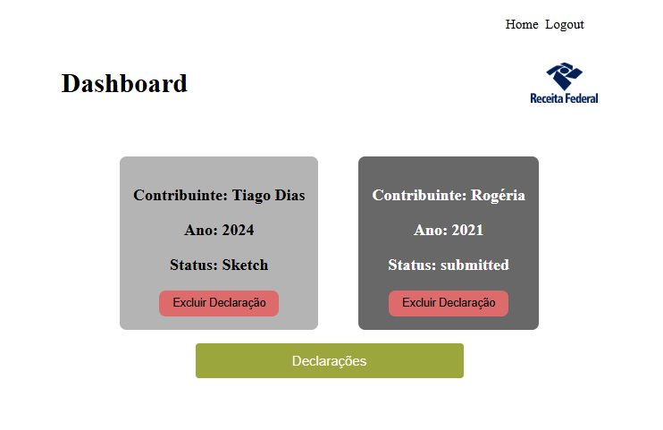

# Tax Declaration Frontend

## Descrição

Este é o frontend de uma aplicação web desenvolvida com o framework [Next.js](https://nextjs.org/) que interage com a [Tax Declaration API](https://github.com/tdiascontato/tax-declaration-api). A aplicação permite que os usuários registrem-se, visualizem e gerenciem suas declarações fiscais de forma intuitiva.
O objetivo é utilizar de forma simples a integração Nextjs com Nestjs, usando Banco de Dados Postegres e podendo ser usado por Docker. Futuras melhorias seriam as implementações de Redis para uma consulta mais rápida e uma Modularização Atômica para um projeto mais escalonável e duradouro.
---

## Funcionalidades

- **Cadastro de usuários**: Os usuários podem se registrar na plataforma para começar a gerenciar suas declarações fiscais.
- **Gerenciamento de declarações fiscais**: Após o login, o usuário pode criar, listar e deletar declarações fiscais. Edite sua declarações clickando nos cards.
- **Exibição de dados**: As declarações fiscais são apresentadas de forma clara e ordenada por ano.

---

## Estrutura do Projeto

O projeto segue a estrutura padrão do Next.js com as seguintes pastas principais:

- **pages**: Contém as páginas principais da aplicação (ex: login, dashboard).
- **components**: Componentes reutilizáveis da aplicação.
- **services**: Funções auxiliares para interagir com a Tax Declaration API.
- **styles**: Arquivos de estilo para a aplicação.
- **public**: Arquivos públicos (imagens, ícones).

---

## Endpoints Consumidos

### Usuários (`/users`)

#### POST `/users/register`
Registra um novo usuário na plataforma.

- **Body:**
  ```json
  {
    "name": "string",
    "email": "string",
    "password": "string"
  }
  ```
- **Resposta Esperada**:
  - **201 Created**: Usuário criado com sucesso.
  - **400 Bad Request**: Email já em uso ou dados inválidos.

#### GET `/users/:id`
Obtém informações de um usuário pelo seu ID.

- **Parâmetros**:
  - `id`: ID do usuário.
- **Resposta Esperada**:
  - **200 OK**: Detalhes do usuário.
  - **404 Not Found**: Usuário não encontrado.

---

### Declarações (`/declarations`)

#### POST `/declarations`
Cria uma nova declaração fiscal.

- **Body:**
  ```json
  {
    "userId": "number",
    "year": "string",
    "data": "JSON"
  }
  ```
- **Resposta Esperada**:
  - **201 Created**: Declaração criada com sucesso.
  - **400 Bad Request**: Dados inválidos.

#### PATCH `/declarations/update/:declarationId`
Atualiza uma declaração fiscal existente.

- **Parâmetros**:
  - `declarationId`: ID da declaração a ser atualizada.
- **Resposta Esperada**:
  - **200 OK**: Declaração atualizada com sucesso.
  - **400 Bad Request**: Dados inválidos ou ID da declaração inválido.
  - **404 Not Found**: Declaração não encontrada.

#### DELETE `/declarations/:declarationId`
Remove uma declaração fiscal.

- **Parâmetros**:
  - `declarationId`: ID da declaração a ser removida.
- **Resposta Esperada**:
  - **200 OK**: Declaração deletada com sucesso.
  - **400 Bad Request**: ID inválido.
  - **404 Not Found**: Declaração não encontrada.

---

### Página Principal (`/`)

#### GET `/`
Retorna uma mensagem de boas-vindas.

- **Resposta Esperada**:
  - **200 OK**: Texto "Hello World!"

---

## Como Executar o Projeto

### Requisitos

- Node.js (versão 14 ou superior)
- Yarn (ou npm)
- A API backend [Tax Declaration API](https://github.com/tdiascontato/tax-declaration-api) deve estar em execução.

## Execução com Docker

1. Certifique-se de ter o Docker instalado em sua máquina.
2. Clone o repositório:
   ```bash
   git clone https://github.com/tdiascontato/tax-declaration-ui
   cd tax-declaration-api
   ```
3. Construa e inicie os contêineres:
   ```bash
   docker-compose up --build
   ```
4. A API estará acessível em: `http://localhost:4000`

### Passos para Execução sem Docker

1. Clone o repositório:
   ```bash
   git clone https://github.com/tdiascontato/tax-declaration-frontend
   cd tax-declaration-frontend
   ```

2. Instale as dependências:
   ```bash
   yarn install
   ```
   ou, caso esteja usando npm:
   ```bash
   npm install
   ```

3. Inicie o servidor de desenvolvimento:
   ```bash
   yarn dev
   ```
   ou, caso esteja usando npm:
   ```bash
   npm run dev
   ```

4. A aplicação estará acessível em: `http://localhost:3000`

---

## Tecnologias Utilizadas

- **Next.js:** Framework para aplicações React com renderização do lado servidor (SSR).
- **React:** Biblioteca JavaScript para construção de interfaces de usuário.
- **Axios:** Cliente HTTP para interagir com a Tax Declaration API.
- **CSS Modules:** Estilização modularizada para os componentes.

## Licença

Este projeto é licenciado sob a [MIT License](LICENSE).